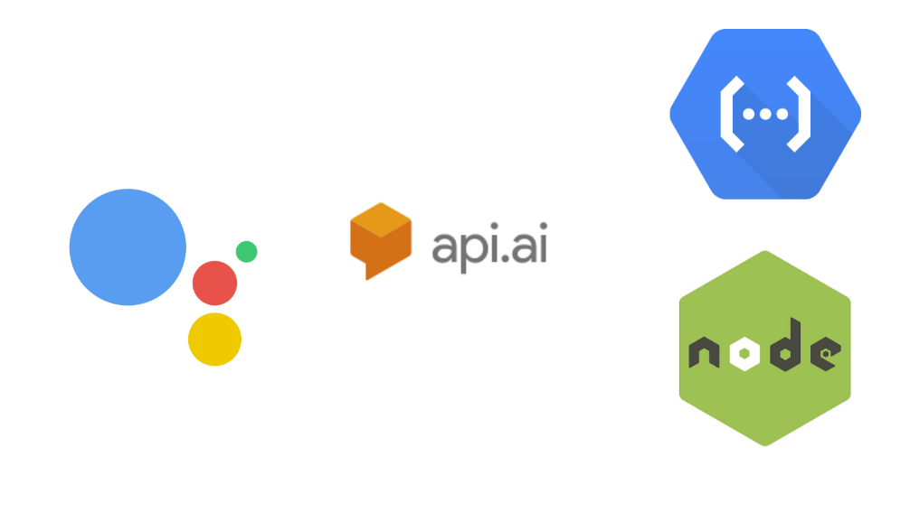
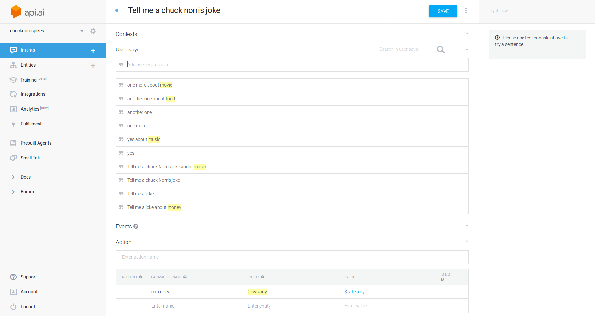
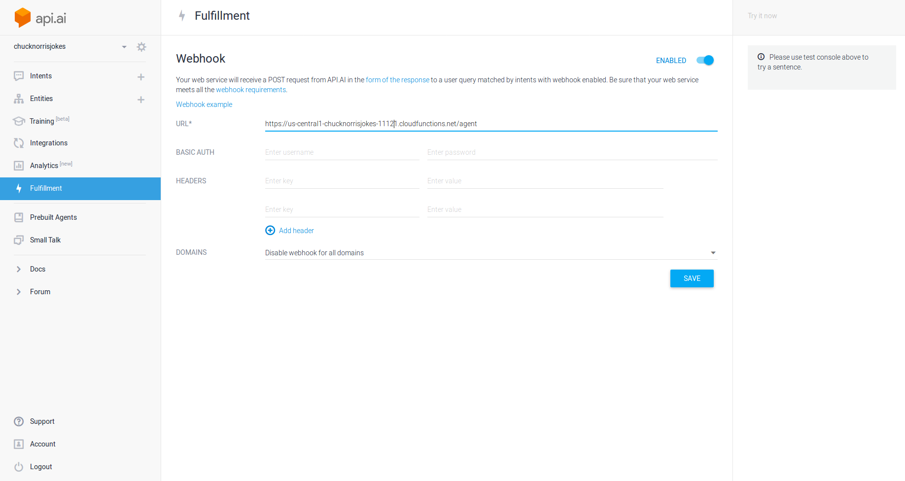

# Build a Serverless Google Home App

In this blog article I want to show you how to build your own google voice app. For Natural language processing, we will use API.AI. Our backend will run on a google cloud function,also called serverless functions, written in nodejs.


## Github
You can find the whole project here on [Github](https://github.com/MoritzGruber/Serverless-Google-Home-App)

## Frontend 
To speak of frontend seems a little bit off first. Since we don't build any visual interface. Nevertheless our natural language processing interface is the closest unit interacting with the end user. 

You can build your own natural language processing unit or use an existing framework such as API.AI. Building on this framework will safe us a lot of time. 

### API.AI
So first we want to create a new Project in API.Ai and make our first intent. As an example, we will build a Chuck Norris joke application. 
Our application will just need one intent, since its only task is, to tell a joke. Every different task can be represented by an intent. 
In our Intent, we want to list different phrases that a user could use. After configuration your intent should look similar to this:

### Category
As an advanced feature, we want API.AI to detect a category for a joke if we name one in our sentence. The category will be passed as a variable to our backend application and can be handled as you see later.


## Backend
In general, you could use any regular rest service as the backend for our application. Ranging from a own server over to cloud containers up to serverless functions. 

I choosed serverless functions because it is the cheapest option, aswell the choice with least configuration needed. You don't have to worry about configuring the google cloud firewall or creating long setup scripts. Furthermore our application won't has a balanced load usage, instead, it will be more like some sparks of resource usage. This is why cloud functions are a perfect match.

The downside of the google cloud is, you are limited to nodejs. So you can only write your functions in javascript for now. But there other cloud providers, such as IBM Bluemix or AWS that has more diversity in stock.

To collect our jokes we use the free service
[api.chucknorris.io](https://api.chucknorris.io/).
So my nodejs index file ended up looking like this:

```javascript
var request = require('request');

exports.agent = function(req, res) {
    var category;
    var topics = ["dev","movie","food","celebrity","science","political","sport","religion","animal","music","history","travel","career","money","fashion"]

    var url = 'https://api.chucknorris.io/jokes/random';
    var returntext;
    try {
        
        var category = req.body.result.parameters.category
        if(topics.indexOf(category) > -1){
            url = url + "?category=" + category;
        }
        request(url, function (error, response, body) {
            if(error){
                console.log(error);
            } else {
                returntext = JSON.parse(body).value;
                return res.json({
                    speech:  returntext,
                    displayText:  returntext,
                    source: 'chucknorris-function'
                });
            }
        });
    } catch (error) {
        console.log('Error extracting req: '+ error);
        return res.json({
                    speech:  "error",
                    displayText:  "error",
                    source: 'chucknorris-function'
                });
    }
};

```
### Deploy 
To deploy this function you need to be logged in in you google cloud. If needed use:
```bash
gsutil init
```

If you haven't created a bucket yet, you can create one with:

```bash
gsutil mb -p chucknorrisjokes-174821 gs://chucknorrisjokes 
```
After that you can deploy your function to this bucket with:

```bash
gcloud beta functions deploy agent --stage-bucket chucknorrisjokes --trigger-http 

```
*The word **agent** is representing the function name in your index.js file*

### Connect to API.AI
The CLI will return a URL, you need to link this with you API.AI project. And don't forget to enable the webhook in your intent.



## Testing and Development
### Emulator
You might have noticed that uploading you function took up to 2 minutes. That's why there is a local emulator for google cloud functions. You can find an [instruction](https://cloud.google.com/functions/docs/emulator) for installation of it here.
You can run your function locally with:

```bash
functions deploy agent --trigger-http
```


### ngrok
Normally we can't talk straight to our localhost from API.AI. That's why we use the tunneling service [ngrok](https://ngrok.com/) to open up our local function to API.AI.
Start ngrok with:
```bash
ngrok http 8010
```

 We just have to replace the webhook URL with URL we get from ngrok. The URL should then look similar to this: 


*https://ca87c845.ngrok.io/chucknorrisjokes-c090c/us-central1/agent*


### Conclusion
I personally see much potential in serverless functions and will consider them for future projects. It is not the easiest way to develop with beta tools but definitely exciting and worth a shot to try out. 

Thanks for reading through my post. For feedback or questions feel free to contact me. 


#### Cheers!

#### Moritz Gruber, mg166
[Website](http://moritzgruber.me)

[Github](https://github.com/MoritzGruber)

[Twitter](https://twitter.com/movCode)
